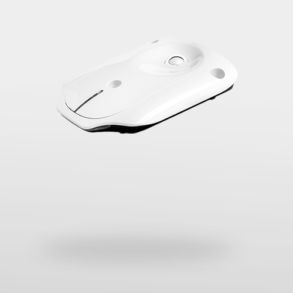
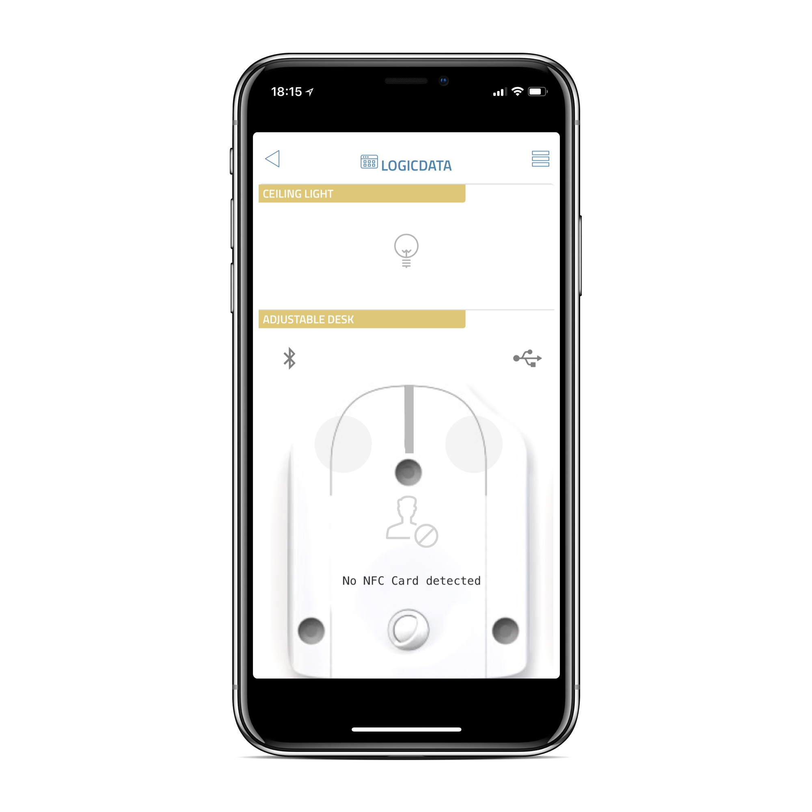

# thing-it-device-logicdata-mqtt

[](https://nodei.co/npm/thing-it-device-logicdata-mqtt/)
[](https://nodei.co/npm/thing-it-device-logicdata-mqtt/)

Device Plugins for [[thing-it-node]](https://github.com/marcgille/thing-it-node) and [thing-it.com](wwww.thing-it.com) for 
LOGICDATA LOGIClink devices built into chairs, desks and other controllable furniture.

<a href="./documentation/images/gateway.png"></a>


The Plugin currently supports the following Devices

* Generic LOGIClink device
* Controllable Chair
* PControllable desk

## Installation and Configuration

### Installation of NodeJS and [thing-it-node]

First, install [nodejs](https://nodejs.org/en/download/) on your computer (e.g. your PC or your Raspberry Pi).

Then install **[thing-it-node]** via

```
npm install -g thing-it-node
```
 
### Initialization and Start of [thing-it-node] 

The **[thing-it-device-logicdata-mqtt]** Plugin is installed with **[thing-it-node]**, hence there is no need to install it separately.

The Plugin supports Autodiscovery, hence you only have to create a directory in which you intend to run the configuration, e.g.
 
```
mkdir ~/logicdata-test
cd ~/logicdata-test
```

and invoke

```
tin init
```

and then start **[thing-it-node]** via

```
tin run
```

Install the **[thing-it] Mobile App** from the Apple Appstore or Google Play and set it up to connect to **[thing-it-node]** 
locally as described [here](https://thing-it.com/thing-it/#/documentationPanel/mobileClient/connectionModes) or just connect your browser under 
[http://localhost:3001](http://localhost:3001).
 
### LOGIClink Device Setup

Connect your logicdata Gateway to an IP network reachable from the **[thing-it-node]** Gateway you have configured above 
and connect/pair all logicdata Devices to it.

## Mobile UI

The following screenshot shows the Devices in [sample configuration]("./examples.configuration"):

<a href="./documentation/images/mobile-ui.png"></a>
